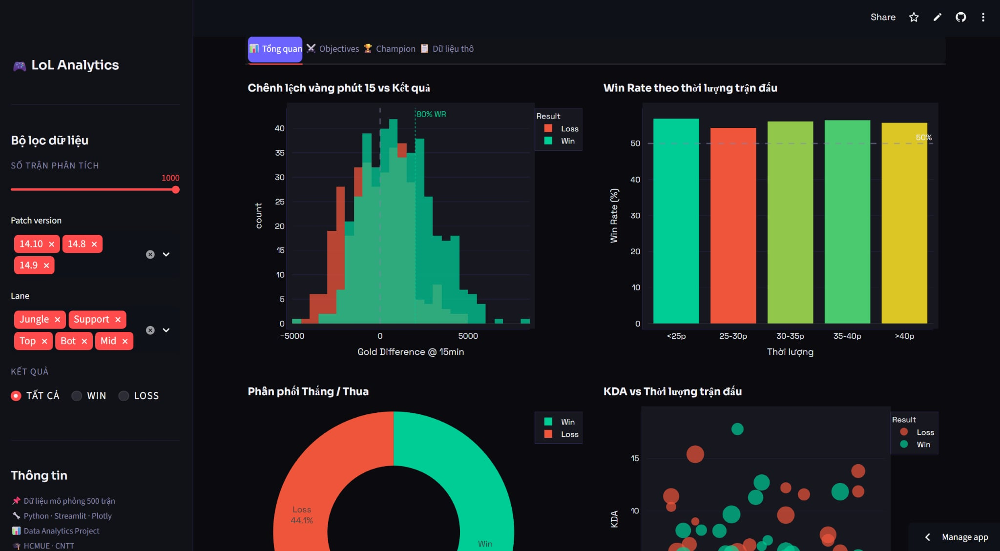
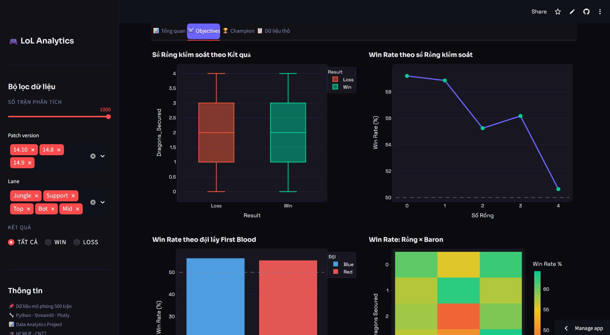

# 🎮 LoL Data Insights — League of Legends Match Analytics

> Ứng dụng phân tích dữ liệu trận đấu League of Legends được xây dựng bằng Python · Streamlit · Plotly

---

## 📸 Demo

> *(Chụp màn hình app sau khi chạy và thêm vào thư mục `screenshots/`)*

| Dashboard | Objectives | Champion Stats |
|-----------|-----------|----------------|
|  |  |  |

---

## ✨ Tính năng

- **📊 Tổng quan** — KPI cards, phân tích Gold Difference, win rate theo thời lượng
- **⚔️ Objectives** — Phân tích Rồng, Baron, First Blood, heatmap objectives
- **🏆 Champion** — Win rate, KDA theo champion và lane, bảng thống kê
- **📋 Dữ liệu thô** — Xem & tải xuống CSV, thống kê mô tả
- **🔧 Sidebar filter** — Lọc theo Patch, Lane, Kết quả, số trận

---

## 🛠️ Công nghệ sử dụng

| Thư viện | Mục đích |
|----------|----------|
| `streamlit` | Web app framework |
| `pandas` | Xử lý và phân tích dữ liệu |
| `plotly` | Biểu đồ tương tác |
| `numpy` | Tạo dữ liệu mô phỏng |

---

## 🚀 Cài đặt & Chạy

### Yêu cầu
- Python 3.9+

### Bước 1 — Clone repo
```bash
git clone https://github.com/vuhuyminh5-arch/lol-analytics-12.git
cd lol-analytics-12
```

### Bước 2 — Cài đặt thư viện
```bash
pip install -r requirements.txt
```

### Bước 3 — Chạy app
```bash
streamlit run app.py
```

Truy cập: `http://localhost:8501`

---

## 📁 Cấu trúc thư mục

```
lol-analytics-12/
├── app.py              # Toàn bộ source code chính
├── requirements.txt    # Danh sách thư viện
├── README.md           # File mô tả này
└── screenshots/        # Ảnh chụp màn hình demo
    ├── dashboard.png
    ├── objectives.png
    └── champion.png
```

---

## 📊 Các phân tích chính

1. **Gold Difference @ 15 phút** — Đội dẫn >2000 vàng có win rate ~80%
2. **Dragon Control** — Kiểm soát 3+ rồng tăng đáng kể tỉ lệ thắng
3. **First Blood** — Lấy First Blood tăng win rate thêm ~5-8%
4. **Game Duration** — Trận dài >40 phút có xu hướng comeback cao hơn
5. **Champion & Lane** — So sánh hiệu suất theo vị trí và tướng

---

## 👤 Tác giả

**Vũ Huy Minh**  
Sinh viên Công nghệ Thông tin — Khoa CNTT  
Đại học Sư phạm TP.HCM (HCMUE)

- GitHub: [github.com/vuhuyminh5-arch](https://github.com/vuhuyminh5-arch)
- Email: vuhuyminh5@gmail.com

---

© 2026 Vũ Huy Minh · Built with ♥ in TP.HCM
